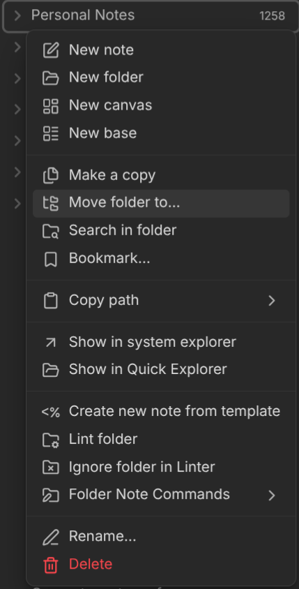
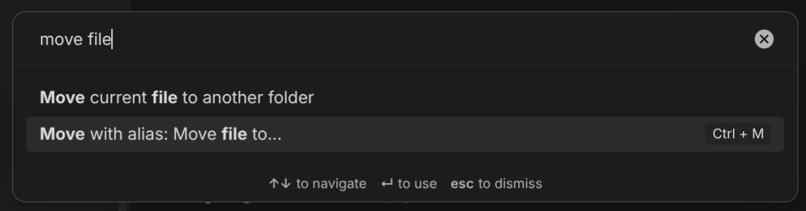

# Move with folder alias

### Introduction
Have you ever created a folder to organize some notes, but couldn't decide between 2 names and just chose one randomly. Then later when you wanted to move a note to that folder you only remember the other name? This plugin offers a solution through folder alias (inspired by [note aliases](https://obsidian.md/help/aliases)). 

You create a note with the same name as the folder, then add aliases to it and when moving a file or a folder, both the original folder and the note alias get suggested.

### How to use
Create a folder note

The default menu items for moving files and folder now support aliases.

In file explorer:

And in the tab menu:

You can also assign hotkeys (here CTRL-M) to the command

